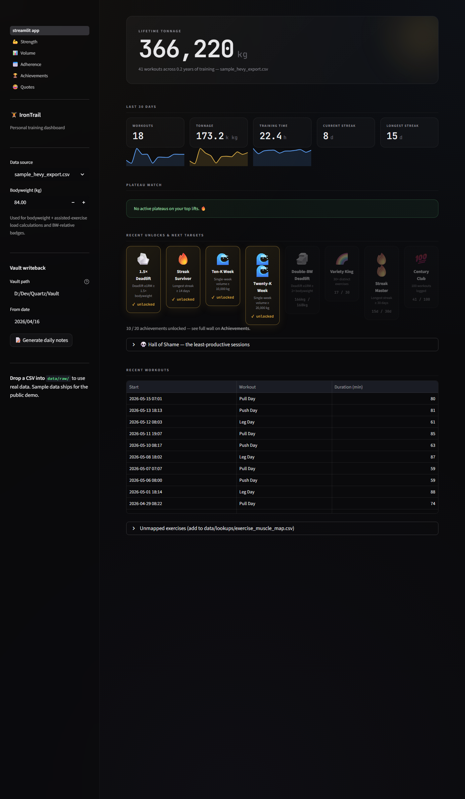
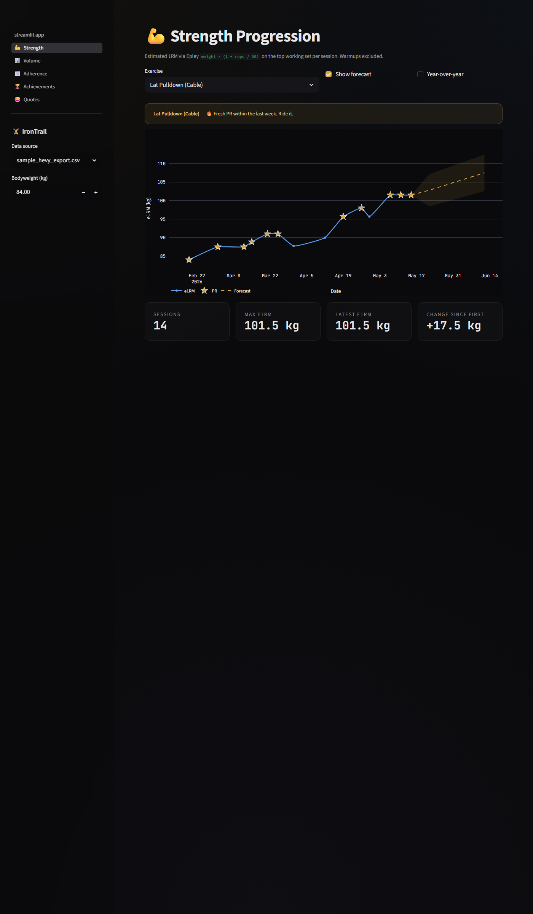
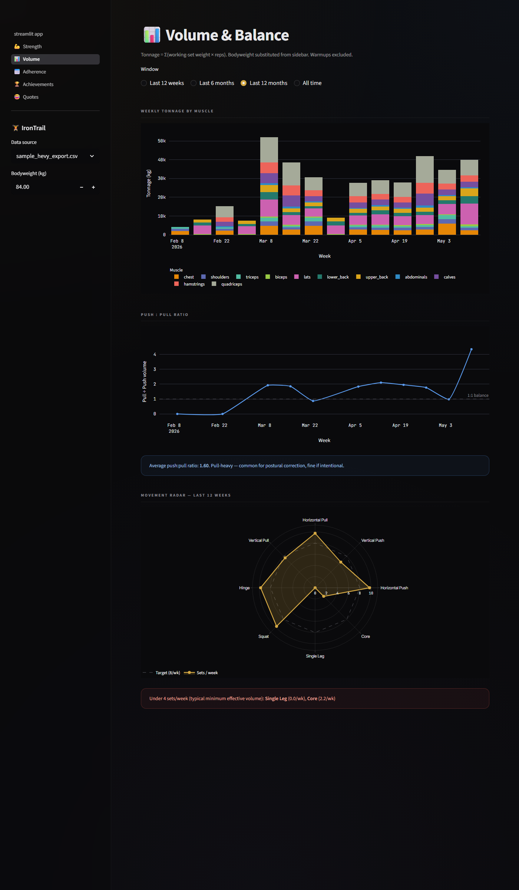
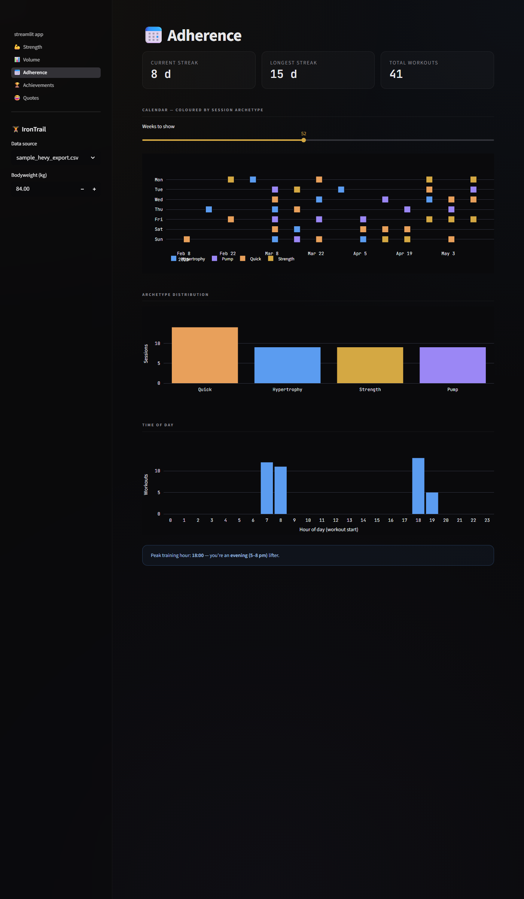
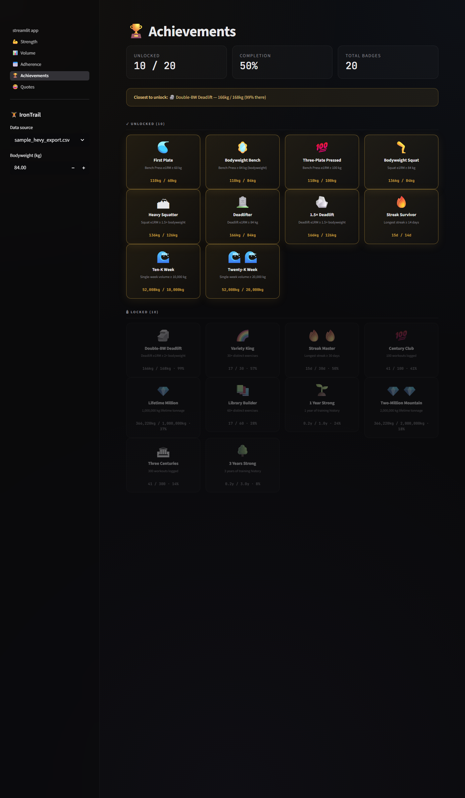

# 🏋️ IronTrail

> **A personal Hevy gym dashboard with personality.** Plateau detection that
> talks back ("💤 Bicep Curl has been napping for 412 days"), K-Means session
> archetypes, a 20-badge achievement wall, a Hall of Shame, and one-click
> writeback to your Obsidian vault as Markdown.

[](./LICENSE)
[](https://www.python.org/)
[](https://streamlit.io/)



## What it is

You export your [Hevy](https://hevyapp.com) workout CSV, drop it into
`data/raw/`, run `streamlit run streamlit_app.py`, and get a five-page
dashboard that actually surfaces the things that matter weekly. No
SaaS, no account, no email field, no "upgrade for charts" wall. Your CSV
stays on your disk. The repo ships with a 90-day synthetic sample dataset
so the public demo runs out-of-the-box for anyone.

The differentiating bit vs prior art is **writeback into the vault**:
every workout becomes `Vault/Hevy/Daily/YYYY-MM-DD.md` with frontmatter,
tonnage, per-exercise breakdown, and your session notes preserved
verbatim. Phase 2 (see [`ROADMAP.md`](./ROADMAP.md)) closes the loop with
an LLM-written weekly review.

## Features

| Page | What it shows |
|---|---|
| 🏋️ **Overview** | Lifetime tonnage hero, last-30-day mini-metrics with sparklines, plateau watch with personality messages, recent unlocks + next targets, Hall of Shame, recent workouts table |
| 💪 **Strength** | Per-exercise e1RM (Epley) trend with PR stars, optional numpy-polyfit forecast with widening confidence band, optional year-over-year overlay |
| 📊 **Volume** | Weekly tonnage stacked by muscle, push:pull ratio over time, 8-pattern movement radar against an 8-sets/week minimum-effective-volume target |
| 📅 **Adherence** | Calendar coloured by K-Means session archetype (Strength / Hypertrophy / Pump / Quick), archetype distribution, time-of-day histogram |
| 🏆 **Achievements** | 20-badge library with progress bars, closest-to-unlock callout, unlocked/locked walls |

Plus a **💀 Hall of Shame** expander on Overview (worst-performing sessions
with witty captions) and a **📝 Generate daily notes** button that writes
per-workout Markdown into a Vault path of your choosing.

### Gallery

<table>
<tr>
  <td align="center" width="50%">
    <b>💪 Strength</b><br>
    
  </td>
  <td align="center" width="50%">
    <b>📊 Volume</b><br>
    
  </td>
</tr>
<tr>
  <td align="center">
    <b>📅 Adherence</b><br>
    
  </td>
  <td align="center">
    <b>🏆 Achievements</b><br>
    
  </td>
</tr>
</table>

## Quickstart

```powershell
# Clone
git clone https://github.com/Lando-00/iron-trail.git
cd iron-trail

# Venv (Python 3.12)
python -m venv .venv
.\.venv\Scripts\Activate.ps1

# Install
pip install -r requirements.txt

# Run on the included synthetic sample data
streamlit run streamlit_app.py
```

Opens at `http://localhost:8501`. The sidebar starts on the synthetic
sample CSV — no Hevy export needed to see the app working.

On macOS / Linux, swap `Activate.ps1` for `source .venv/bin/activate`.

## Use your own data

1. In the Hevy app: **Profile → Settings → Export Workout Data**.
2. Save the CSV into `data/raw/`. It's [gitignored](.gitignore) — your data
   stays local.
3. In the IronTrail sidebar, pick your CSV from the **Data source** dropdown.
4. Set your **Bodyweight (kg)** in the sidebar — it's used to compute load
   for bodyweight + bodyweight-assisted exercises (e.g. assisted pull-ups)
   and for any bodyweight-relative badge.
5. Optional: click **📝 Generate daily notes** to write
   `Vault/Hevy/Daily/YYYY-MM-DD.md` into the vault path you specify in the
   sidebar.

## Configuration

### Default bodyweight

Edit `BODY_WEIGHT_KG` in [`iron_trail/config.py`](iron_trail/config.py) to
change the value the sidebar starts at. The sidebar input is authoritative
at runtime — this is just the default.

### Exercise → muscle map

[`data/lookups/exercise_muscle_map.csv`](data/lookups/exercise_muscle_map.csv)
maps every exercise name to:

| Column | Drives |
|---|---|
| `primary_muscle` | Volume-by-muscle stacked bar |
| `equipment` | Filtering / display |
| `movement_type` | Push:pull ratio (push / pull / legs / core / cardio) |
| `movement_pattern` | Movement radar (Horizontal Push / Squat / Hinge / etc.) |
| `load_type` | Bodyweight load substitution (`weighted` / `bodyweight` / `assisted` / `cardio`) |

Exercises you log but haven't mapped show up in the **Unmapped exercises**
expander on the Overview page — add a row for each.

## Data flow

```
┌─────────────────────────────────────────────────────────────┐
│  data/raw/your_hevy_export.csv      (gitignored, local-only) │
│  data/sample/sample_hevy_export.csv (committed, synthetic)   │
└──────────────────────────┬──────────────────────────────────┘
                           │
                           ▼
┌─────────────────────────────────────────────────────────────┐
│  iron_trail.ingest.load_and_clean()                         │
│    - parse locale timestamps (dateparser)                   │
│    - join exercise_muscle_map.csv                           │
│    - substitute bodyweight for BW + assisted sets           │
│    - flag warmup vs working                                 │
│    - derive volume_kg and e1rm_kg per set                   │
└──────────────────────────┬──────────────────────────────────┘
                           │
              ┌────────────┴────────────┐
              ▼                         ▼
┌──────────────────────────┐  ┌──────────────────────────────┐
│  Streamlit pages         │  │  iron_trail.vault_notes      │
│   - Overview             │  │   write_daily_notes()        │
│   - Strength             │  │   → Vault/Hevy/Daily/        │
│   - Volume               │  │       YYYY-MM-DD.md          │
│   - Adherence            │  │   (frontmatter + per-ex      │
│   - Achievements         │  │    breakdown + notes)        │
└──────────────────────────┘  └──────────────────────────────┘
```

## Privacy

- **Your CSV stays local.** `data/raw/*` is [gitignored](.gitignore) (only
  the `.gitkeep` is tracked).
- **No secrets needed.** Bodyweight is configured via the sidebar at
  runtime — `.streamlit/secrets.toml` is gitignored as a precaution but the
  app doesn't read any secrets.
- **No telemetry.** `.streamlit/config.toml` sets
  `gatherUsageStats = false`.
- **No network calls.** Phase 1 is fully offline.

If you self-host on [Streamlit Community Cloud](https://share.streamlit.io)
the only data exposed is whatever CSV you commit — which should remain
nothing real, since `data/raw/*` is gitignored.

## Stack

| Layer | Choice |
|---|---|
| Language | Python 3.12 |
| UI | [Streamlit](https://streamlit.io) 1.57 (multi-page) |
| Data | Pandas 2 |
| Charts | [Plotly](https://plotly.com/python/) 6 |
| Dates | [dateparser](https://github.com/scrapinghub/dateparser) (locale-aware) |
| ML | [scikit-learn](https://scikit-learn.org/) (K-Means archetypes) + numpy.polyfit (forecast) |
| Theme | Custom CSS in [`iron_trail/theme.py`](iron_trail/theme.py) |

## Deployment — Streamlit Community Cloud

The repo is ready to deploy as-is:

1. Push to a public GitHub repo (see commands at bottom of README).
2. Go to [share.streamlit.io](https://share.streamlit.io) and connect your
   GitHub account.
3. Pick this repo, set the entry point to `streamlit_app.py`, and set the
   Python version to **3.12** (matches [`.python-version`](.python-version)).
4. Click deploy. There are no secrets to configure — bodyweight and vault
   path are runtime sidebar inputs.
5. Your dashboard is live at
   `https://<your-app>.streamlit.app`. The public demo runs against the
   committed synthetic sample.

## Roadmap

See [`ROADMAP.md`](./ROADMAP.md). TL;DR:

- **Phase 1 — Done.** The dashboard you see in the screenshots above.
- **Phase 2 — AI Training Coach.** Weekly LLM-written review note in the
  vault.
- **Phase 3 — Cross-source.** Hevy Pro API for auto-sync, Samsung Health
  Connect for recovery context, Strength Standards percentile rankings.

## Contributing

PRs welcome — see [`CONTRIBUTING.md`](./CONTRIBUTING.md).

## Prior art / credits

IronTrail stands on the shoulders of every Hevy analytics project that came
before it. In particular:

- **[LiftShift](https://liftshift.app)** — beautiful React + IndexedDB
  in-browser dashboard with 425⭐. Inspired the session-intent / archetype
  classification angle.
- **[HevyWorkoutAnalyzer](https://hevyworkoutanalyzer.streamlit.app)** —
  the closest reference architecture (Streamlit + Pandas + Plotly). Living
  proof the stack works.
- **[casudo/Hevy-Insights](https://github.com/casudo/Hevy-Insights)** —
  FastAPI + Vue. Inspired the plateau-detection algorithm.
- **[radupana/openweight](https://github.com/radupana/openweight)** —
  exhaustive CSV column reference that saved an afternoon of reverse
  engineering.

## Project layout

```
iron-trail/
├── streamlit_app.py             # Overview page (entry point)
├── pages/                       # Auto-discovered Streamlit pages
│   ├── 1_💪_Strength.py
│   ├── 2_📊_Volume.py
│   ├── 3_📅_Adherence.py
│   ├── 4_🏆_Achievements.py
│   └── 5_😂_Quotes.py
├── iron_trail/                  # Python package
│   ├── analytics.py             # plateaus, archetypes, awards, hall of shame
│   ├── comedy.py                # captions + quotes
│   ├── config.py                # paths + default bodyweight
│   ├── ingest.py                # CSV → long-format cleaned DataFrame
│   ├── metrics.py               # e1RM, volume, streaks, push:pull
│   ├── normalize.py             # exercise-name normalisation
│   ├── theme.py                 # colour palette + CSS
│   ├── ui.py                    # shared rendering primitives
│   └── vault_notes.py           # Vault writeback
├── data/
│   ├── raw/                     # YOUR Hevy exports (gitignored)
│   ├── sample/                  # synthetic sample CSV (committed)
│   ├── lookups/                 # exercise_muscle_map.csv (committed)
│   └── processed/               # parquet cache (gitignored)
├── scripts/
│   ├── generate_sample_data.py  # rebuild the synthetic CSV (seed=42)
│   ├── snapshot_public.py       # Playwright screenshots → docs/screenshots/
│   ├── snapshot_pages.py        # local-dev variant → scripts/screenshots/
│   └── write_vault_notes.py     # CLI version of the sidebar button
├── docs/
│   └── screenshots/             # README screenshots (sample-data only)
├── .streamlit/config.toml       # theme + telemetry-off
├── requirements.txt
├── pyproject.toml
├── ROADMAP.md
├── CONTRIBUTING.md
└── LICENSE                      # MIT
```

## Data model

After `iron_trail.ingest.load_and_clean(path)`, you get a long-format
DataFrame with one row per set:

| Column | Notes |
|---|---|
| `workout_id`, `workout_date`, `title` | Workout-level identifiers |
| `start_time`, `end_time`, `duration_min` | Locale-parsed via `dateparser` |
| `exercise_title` | Normalised |
| `primary_muscle`, `equipment`, `movement_type`, `movement_pattern`, `load_type` | From `exercise_muscle_map.csv` |
| `set_type`, `set_index`, `is_warmup`, `is_working` | Set classification |
| `weight_kg_load` | Actual load: raw `weight_kg` for weighted, bodyweight for bodyweight, `BW − assist` for assisted |
| `reps` | Working reps |
| `volume_kg` | `weight_kg_load × reps` for working sets, `0` otherwise |
| `e1rm_kg` | Epley estimate: `weight_kg_load × (1 + reps / 30)` |

## Caveats

- **RPE is almost always null** in Hevy CSVs — don't build features on it.
- **Exercise name strings drift over time** (Hevy renames, custom-vs-canonical).
  The CSV doesn't have a stable exercise ID — the Pro API does. Watch out
  if you analyse multi-year history.
- **CSV timestamps are locale-strings without timezones.** `dateparser`
  handles non-English month names; we drop the timezone layer entirely.
- **Cardio volume is 0** by design — duration is a separate metric. Cardio
  is excluded from push:pull and the movement radar.

## Local dev on Windows ARM64 (Surface Pro)

The project runs fine on an ARM64 Windows host, but use **x86_64 Python**
because `pyarrow` (a hard Streamlit dependency) has no native Windows ARM64
wheel. x64 builds run under Windows' x86 emulation and performance is
comfortably fast for this single-user analytical workload.

```powershell
# Pick any x64 Python you have installed; this example uses 3.12 from
# the system Python installer:
& "C:\Program Files\Python312\python.exe" -m venv .venv
.\.venv\Scripts\Activate.ps1
pip install -r requirements.txt
```

`python -c "import sys; print(sys.version)"` should report `64 bit (AMD64)`.

## Regenerate sample data

```powershell
python scripts/generate_sample_data.py
```

Deterministic (`seed=42`), 90 days, ~3 sessions/week with one missed week
and one plateaued lift.

## Regenerate README screenshots

```powershell
# Hide your real CSV so the app falls back to the sample
Move-Item data/raw/your_hevy_export.csv data/raw/_your_hevy_export.csv.bak

# In one terminal:
streamlit run streamlit_app.py --server.port 8507 --server.headless true

# In another (after ~12s for first health check):
python scripts/snapshot_public.py

# Restore your CSV
Move-Item data/raw/_your_hevy_export.csv.bak data/raw/your_hevy_export.csv
```

## License

[MIT](./LICENSE) © 2026 [Lando-00](https://github.com/Lando-00).
